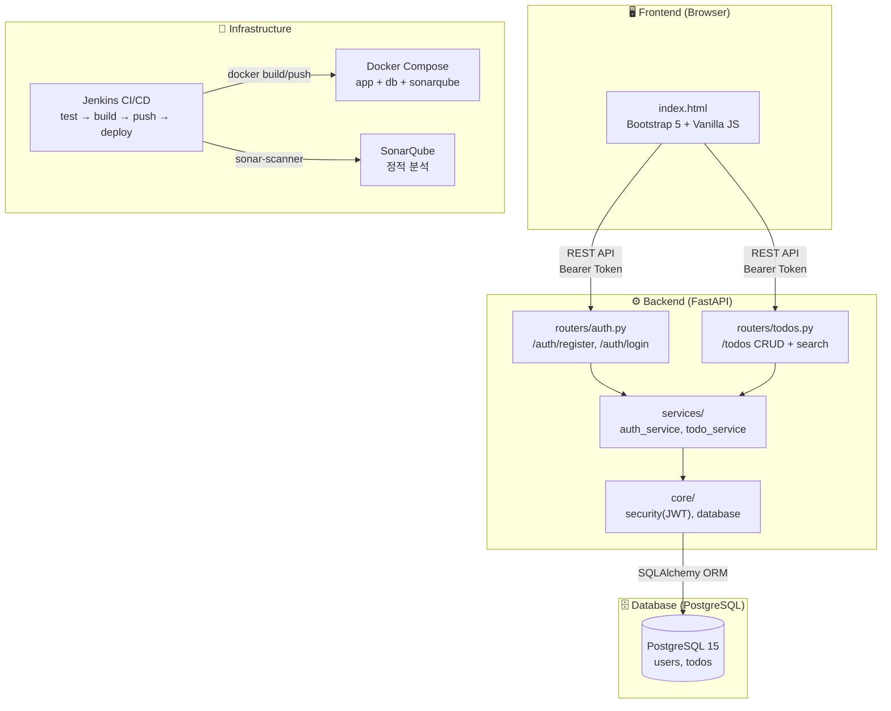
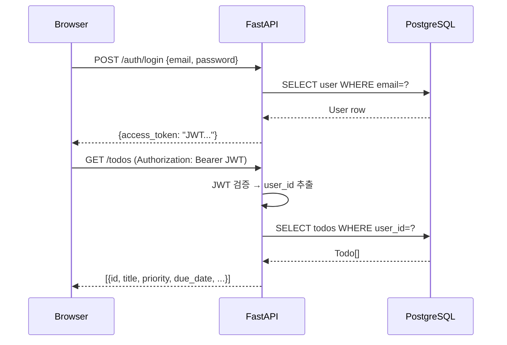
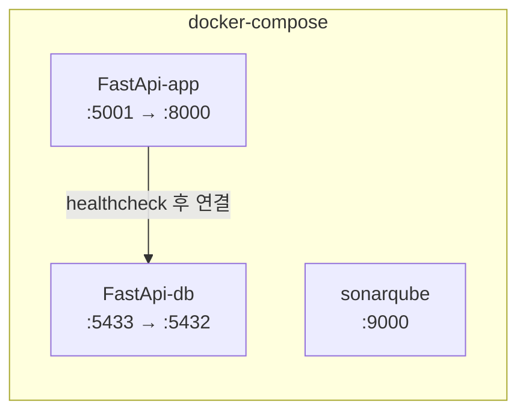

# 기술 아키텍처 다이어그램 (Architecture Diagram)
## My TodoList 앱 — v5.0.0

---

## 3-Tier 아키텍처

```mermaid
graph TD
    subgraph Frontend["🖥️ Frontend (Browser)"]
        HTML["index.html<br/>Bootstrap 5 + Vanilla JS"]
    end

    subgraph Backend["⚙️ Backend (FastAPI)"]
        AUTH["routers/auth.py<br/>/auth/register, /auth/login"]
        TODOS["routers/todos.py<br/>/todos CRUD + search"]
        SVC["services/<br/>auth_service, todo_service"]
        CORE["core/<br/>security(JWT), database"]
    end

    subgraph Database["🗄️ Database (PostgreSQL)"]
        PG[("PostgreSQL 15<br/>users, todos")]
    end

    subgraph Infra["🔧 Infrastructure"]
        DOCKER["Docker Compose<br/>app + db + sonarqube"]
        JENKINS["Jenkins CI/CD<br/>test → build → push → deploy"]
        SONAR["SonarQube<br/>정적 분석"]
    end

    HTML -->|"REST API<br/>Bearer Token"| AUTH
    HTML -->|"REST API<br/>Bearer Token"| TODOS
    AUTH --> SVC
    TODOS --> SVC
    SVC --> CORE
    CORE -->|"SQLAlchemy ORM"| PG

    JENKINS -->|"docker build/push"| DOCKER
    JENKINS -->|"sonar-scanner"| SONAR
```

---

## 요청 흐름

```mermaid
sequenceDiagram
    participant B as Browser
    participant F as FastAPI
    participant DB as PostgreSQL

    B->>F: POST /auth/login {email, password}
    F->>DB: SELECT user WHERE email=?
    DB-->>F: User row
    F-->>B: {access_token: "JWT..."}

    B->>F: GET /todos (Authorization: Bearer JWT)
    F->>F: JWT 검증 → user_id 추출
    F->>DB: SELECT todos WHERE user_id=?
    DB-->>F: Todo[]
    F-->>B: [{id, title, priority, due_date, ...}]
```

---

## 컨테이너 구성

```mermaid
graph LR
    subgraph docker-compose
        APP["FastApi-app<br/>:5001 → :8000"]
        DB["FastApi-db<br/>:5433 → :5432"]
        SQ["sonarqube<br/>:9000"]
    end

    APP -->|"healthcheck 후 연결"| DB
```
