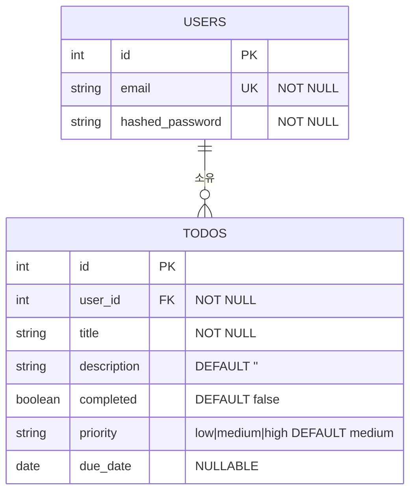

# ERD (Entity Relationship Diagram)
## My TodoList 앱 — v5.0.0

---

## ERD

---

## 테이블 명세

### users

| 컬럼 | 타입 | 제약 | 설명 |
|------|------|------|------|
| id | INTEGER | PK, AUTO INCREMENT | 사용자 고유 식별자 |
| email | VARCHAR | UNIQUE, NOT NULL | 로그인 이메일 |
| hashed_password | VARCHAR | NOT NULL | bcrypt 해시된 비밀번호 |

### todos

| 컬럼 | 타입 | 제약 | 설명 |
|------|------|------|------|
| id | INTEGER | PK, AUTO INCREMENT | 할 일 고유 식별자 |
| user_id | INTEGER | FK(users.id), NOT NULL | 소유자 |
| title | VARCHAR | NOT NULL | 할 일 제목 |
| description | VARCHAR | DEFAULT '' | 상세 설명 |
| completed | BOOLEAN | DEFAULT false | 완료 여부 |
| priority | VARCHAR | DEFAULT 'medium' | low / medium / high |
| due_date | DATE | NULLABLE | 계획 완료일 |

---

## 관계 규칙

- User : Todo = 1 : N (한 사용자가 여러 할 일 보유)
- Todo의 `user_id`는 반드시 `users.id`를 참조해야 한다
- 사용자 삭제 시 해당 사용자의 모든 Todo도 함께 삭제 (CASCADE)
